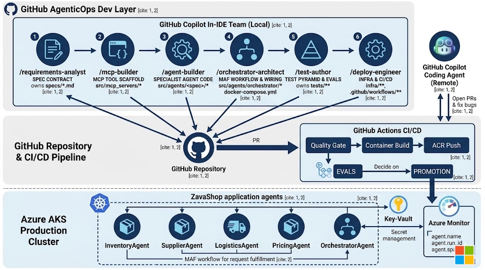

# ZavaShop on AKS + ACA — built by **GitHub Copilot Multi Custom Coding Agents**



> A hands-on lab series that teaches you to deliver a multi-agent retail supply-chain solution **end-to-end through a team of six GitHub Copilot Custom Coding Agents** — from requirements through deployment.
> Stack: **Microsoft Agent Framework (MAF)** + **GitHub Copilot SDK** (`gpt-5.5`) + **AKS** + **Azure Container Apps** + **Microsoft Entra ID** + **Microsoft Defender for Cloud**.

---

## 🧭 What makes this lab different

Every artifact in this repo — specs, agent code, MCP servers, tests, Bicep, Helm, CI — is authored by a **named GitHub Copilot Custom Coding Agent** that owns one slice of the repo and carries its own tools, skills, and refusal rules.

The labs teach the **operating model itself** — not just the code. By the end you will have shipped ZavaShop *and* internalised a repeatable Copilot Custom Agent workflow you can take to any project.

```
       ┌─────────────────────── GitHub Copilot Multi Custom Agents ───────────────────────┐
       │                                                                                  │
 Issue ─►  /requirements-analyst  ─►  specs/<slug>.md                                      │
                  │                                                                       │
                  ▼                                                                       │
          /mcp-builder  ───────►  src/mcp_servers/*                                        │
          /agent-builder  ─────►  src/agents/<specialist>/*                                │
          /orchestrator-architect ─► src/agents/orchestrator, src/shared, docker-compose   │
                  │                                                                       │
                  ▼                                                                       │
          /test-author  ───────►  tests/** (unit · integration · evals)                    │
                  │                                                                       │
                  ▼                                                                       │
          /deploy-engineer  ───►  infra/** + .github/workflows/** + ACR/ACA/AKS rollout    │
       └──────────────────────────────────────────────────────────────────────────────────┘
```

Each agent is a file under [.github/agents/](.github/agents/) (`*.agent.md`). You invoke it by typing `/<agent-name>` in Copilot Chat. Three workflow prompts in [.github/prompts/](.github/prompts/) chain the agents together: `/feature-from-issue`, `/spec-to-code`, `/ship-it`.

## 🚀 Fast Deploy Track

The full lab path teaches every engineering step. For workshops and demos, use the **fast deploy track**: let the workflow prompts drive the custom-agent handoffs, generate the application code and deployment artifacts as one packaged application, then deploy the built images through a single `/ship-it` flow.

Fast path:

1. Complete [Lab 01](./labs/lab-01-environment-setup/README.md) once to create the Azure foundation.
2. Run `/feature-from-issue` with the ZavaShop stock-out scenario. Follow its handoffs to the owning custom agents instead of manually designing each coding prompt.
3. Run `/ship-it` to build all service images, deploy ACA specialists/MCP servers, deploy the AKS orchestrator, smoke-test `/healthz`, and run evals.

This reduces the application coding portion from open-ended manual prompting into a guided workflow while preserving the same generated structure under `src/`, `tests/`, and `infra/`. The resulting deployment must still satisfy the AKS landing zone, Entra ID, and Defender for Cloud gates described in Labs 01 and 05.

---

## 🛍 The Story: ZavaShop

**ZavaShop** is a fast-growing global retailer with 500+ stores. Their supply chain runs on a mix of legacy ERPs, supplier portals, and ad-hoc spreadsheets. The Ops team wants an AI-native control plane — a fleet of cooperating agents that:

| Application Agent | Responsibility |
|---|---|
| `InventoryAgent` | Monitor stock-out risk across stores and warehouses |
| `SupplierAgent` | Negotiate purchase orders with suppliers via MCP-backed tools |
| `LogisticsAgent` | Plan shipments, track ETAs, re-route on disruption |
| `PricingAgent` | Recommend dynamic pricing from demand + competitor signals |
| `OrchestratorAgent` | The "store manager" — powered by the **GitHub Copilot SDK**, routes goals to the specialist agents |

The orchestrator runs as a **long-lived service on AKS**. The specialist agents run as **event-driven workloads on ACA** with **KEDA scale-to-zero**. All agents share a fleet of **MCP servers** that wrap ZavaShop's domain tools (inventory DB, supplier API, shipping API, pricing API).

```
┌────────────────────────────────────────────────────────────────┐
│                       AKS  (control plane)                     │
│   ┌──────────────────────────────────────────────────────────┐ │
│   │  OrchestratorAgent  (GitHub Copilot SDK + MAF Workflow)  │ │
│   └─────────┬────────────────────────────────────────────────┘ │
└─────────────┼──────────────────────────────────────────────────┘
              │ A2A / HTTP
   ┌──────────┼──────────┬──────────────┬──────────────┐
   ▼          ▼          ▼              ▼              ▼
┌─────────┐┌─────────┐┌──────────┐┌────────────┐┌──────────┐
│Inventory││Supplier ││Logistics ││  Pricing   ││   MCP    │
│  ACA    ││  ACA    ││   ACA    ││    ACA     ││ Servers  │
└─────────┘└─────────┘└──────────┘└────────────┘└──────────┘
```

### Story arc across the labs

The five labs are five chapters of one story — ZavaShop going from a blank Azure subscription to a live, observable retail control plane:

| Lab | Chapter | What changes in ZavaShop's world |
|---|---|---|
| 01 | **Day 0 — lay the foundation** | The platform team provisions the loading docks (ACR), the shop floor (AKS), the bursty back-of-house (ACA), the safe (Key Vault), and the single staff badge (UAMI) that every worker will wear. |
| 02 | **Hire the specialists** | Each business role becomes a typed MAF `ChatAgent`. Inventory, Supplier, Logistics, Pricing, and the Orchestrator are born — every external system kept behind an MCP server so the LLM never owns business state. Fast-track users can drive this through `/feature-from-issue`. |
| 03 | **Make them a team** | The orchestrator stops being a one-shot LLM call and becomes a deterministic `Workflow`. Secrets leave `.env` and move into Key Vault. The whole fleet boots locally via Docker Compose so a `/plan` can be debugged end-to-end without the cloud. |
| 04 | **Earn trust before opening day** | A four-layer test pyramid + five golden eval scenarios (S1–S5) pin the fleet's behaviour. The same `uv run poe check` runs in GitHub Actions, so even Copilot-authored PRs must pass the human bar. |
| 05 | **Open the store** | `/ship-it` rolls the orchestrator to AKS behind Workload Identity + CSI-mounted token, and the 8 specialist/MCP services to ACA with scale-to-zero. GitHub Actions OIDC re-runs the same pipeline on every `main`, with AKS landing zone, Entra ID, Azure Policy, monitoring, and Defender for Cloud checks. |

> ⚠️ Don't confuse the two layers:
> - **Application agents** (the table above) — the runtime ZavaShop fleet you deploy.
> - **GitHub Copilot Custom Coding Agents** (`/requirements-analyst` etc.) — the dev-time team that *writes* the application agents for you.

---

## 👥 Meet the GitHub Copilot Custom Coding Agents

| Phase | Coding Agent | Owns | File |
|---|---|---|---|
| Requirements | `/requirements-analyst` | `specs/*.md` only — refuses to write code | [.github/agents/requirements-analyst.agent.md](.github/agents/requirements-analyst.agent.md) |
| MCP impl | `/mcp-builder` | `src/mcp_servers/*` (one server per turn) | [.github/agents/mcp-builder.agent.md](.github/agents/mcp-builder.agent.md) |
| Agent impl | `/agent-builder` | `src/agents/<specialist>/*` (one specialist per turn) | [.github/agents/agent-builder.agent.md](.github/agents/agent-builder.agent.md) |
| Orchestration | `/orchestrator-architect` | `src/agents/orchestrator/*`, `src/shared/*`, `docker-compose.yml` | [.github/agents/orchestrator-architect.agent.md](.github/agents/orchestrator-architect.agent.md) |
| Tests | `/test-author` | `tests/**` only — never edits `src/` | [.github/agents/test-author.agent.md](.github/agents/test-author.agent.md) |
| Deploy | `/deploy-engineer` | `infra/**`, `.github/workflows/**` | [.github/agents/deploy-engineer.agent.md](.github/agents/deploy-engineer.agent.md) |

Shared, agent-agnostic knowledge lives in [.github/skills/](.github/skills/) — every coding agent declares which skills it must consult before writing code.

Workflow prompts in [.github/prompts/](.github/prompts/):

- **`/feature-from-issue`** — issue → spec → code → tests → PR → deploy.
- **`/spec-to-code`** — drive an existing spec through code + tests.
- **`/ship-it`** — quality gate → build → push → ACR/ACA/AKS rollout → smoke + evals.

> **Hard rule (see [AGENTS.md](AGENTS.md) §1.1):** for every code change, invoke the right `/<agent>` from the table above. Each agent carries the tools, skills, and refusal rules needed for its slice of the repo.

---

## 🗺 Lab Index

| # | Lab | Coding agents you'll drive | What you build |
|---|---|---|---|
| 01 | [Environment Setup](./labs/lab-01-environment-setup/README.md) | — | Azure subscription, landing-zone-aware AKS cluster, ACA env, ACR, Key Vault, Entra ID/RBAC, Defender for Cloud, Workload Identity, then **install the 6 Copilot Custom Agents** |
| 02 | [Agent Creation](./labs/lab-02-agent-creation/README.md) | `/requirements-analyst` → `/mcp-builder` ×4 → `/agent-builder` ×4 → `/orchestrator-architect` | The five ZavaShop application agents in Python with MAF + Copilot SDK |
| 03 | [Multi-Agent Orchestration & Config](./labs/lab-03-orchestration/README.md) | `/requirements-analyst` → `/spec-to-code` → `/orchestrator-architect` | MAF Workflow, A2A wiring, MCP tools, Key Vault hydration, Docker Compose |
| 04 | [Testing](./labs/lab-04-testing/README.md) | `/test-author` (unit + MCP + integration + evals) → remote **GitHub Copilot Coding Agent** PR loop | Full test pyramid; assign GitHub-side Copilot to a failing-eval issue |
| 05 | [Deployment & Run](./labs/lab-05-deployment/README.md) | `/deploy-engineer` + `/ship-it` | Packaged app images, Helm for AKS, Bicep for ACA, OIDC-federated CD, landing zone security gates, Day-2 partial roll |

Each lab opens with its own **ZavaShop story** beat and a curated **Microsoft Learn knowledge points** list — read those first to anchor the operations in concepts.

---

## 📚 Microsoft Learn knowledge map

The Learn references are grouped by the concern they answer. Every link is also embedded inside the lab that uses it.

### Platform foundations (Lab 01)

- [AKS landing zone accelerator](https://learn.microsoft.com/azure/cloud-adoption-framework/scenarios/app-platform/aks/landing-zone-accelerator)
- [AKS architecture guidance](https://learn.microsoft.com/azure/architecture/reference-architectures/containers/aks-start-here)
- [Azure Kubernetes Service (AKS) overview](https://learn.microsoft.com/azure/aks/intro-kubernetes)
- [Azure Container Apps overview](https://learn.microsoft.com/azure/container-apps/overview)
- [Azure Container Registry introduction](https://learn.microsoft.com/azure/container-registry/container-registry-intro)
- [Azure Key Vault overview](https://learn.microsoft.com/azure/key-vault/general/overview)
- [Managed identities for Azure resources](https://learn.microsoft.com/entra/identity/managed-identities-azure-resources/overview)
- [Microsoft Defender for Cloud](https://learn.microsoft.com/azure/defender-for-cloud/defender-for-cloud-introduction)

### Identity & secret-less auth (Labs 01, 03, 05)

- [Microsoft Entra ID integration with AKS](https://learn.microsoft.com/azure/aks/enable-authentication-microsoft-entra-id)
- [Use Azure RBAC for Kubernetes Authorization](https://learn.microsoft.com/azure/aks/manage-azure-rbac)
- [AKS Workload Identity](https://learn.microsoft.com/azure/aks/workload-identity-overview)
- [Workload Identity Federation](https://learn.microsoft.com/entra/workload-id/workload-identity-federation)
- [GitHub Actions OIDC federation with Azure](https://learn.microsoft.com/azure/developer/github/connect-from-azure-openid-connect)
- [Secrets Store CSI driver on AKS](https://learn.microsoft.com/azure/aks/csi-secrets-store-driver)
- [`DefaultAzureCredential` for Python](https://learn.microsoft.com/python/api/overview/azure/identity-readme)

### Agents, MCP & the Copilot SDK (Labs 02, 03)

- [Microsoft Agent Framework](https://learn.microsoft.com/agent-framework/)
- [Customize GitHub Copilot Chat with custom agents](https://docs.github.com/copilot/customizing-copilot/about-customizing-github-copilot-chat-responses)
- [Model Context Protocol on Microsoft Learn](https://learn.microsoft.com/azure/developer/ai/)
- [Docker Compose for multi-container development](https://learn.microsoft.com/visualstudio/docker/tutorials/multi-container-apps)
- [Observability for AI apps with OpenTelemetry](https://learn.microsoft.com/azure/azure-monitor/app/opentelemetry-overview)

### Testing & quality gate (Lab 04)

- [pytest with the Azure SDK](https://learn.microsoft.com/azure/developer/python/sdk/azure-sdk-test-overview)
- [Continuous integration with GitHub Actions](https://learn.microsoft.com/training/modules/github-actions-ci/)
- [Safety system for AI applications](https://learn.microsoft.com/azure/ai-services/openai/concepts/safety-system)

### Deployment (Lab 05)

- [AKS Helm quickstart](https://learn.microsoft.com/azure/aks/quickstart-helm)
- [Azure Container Apps with Bicep](https://learn.microsoft.com/azure/container-apps/microservices-bicep)
- [ACR Tasks](https://learn.microsoft.com/azure/container-registry/container-registry-tasks-overview)
- [KEDA scale rules on Container Apps](https://learn.microsoft.com/azure/container-apps/scale-app)
- [Bicep `what-if` deployments](https://learn.microsoft.com/azure/azure-resource-manager/bicep/deploy-what-if)

---

## ✅ Prerequisites

- Azure subscription with **Owner** on a resource group
- Azure CLI ≥ 2.65, `kubectl`, `helm`, `docker`, `uv` (or `pip`)
- Python **3.11+**
- A **GitHub Copilot** subscription (Individual / Business / Enterprise)
- VS Code with **GitHub Copilot** + **GitHub Copilot Chat** extensions
  - After cloning, run **`Developer: Reload Window`** so VS Code discovers `.github/agents/*.agent.md` and the six ZavaShop agents appear in the `/`-invocation picker.

---

## 📚 How to use Copilot in this lab

1. **Read [AGENTS.md](./AGENTS.md)** — the house rules every coding agent obeys.
2. Open Copilot Chat. Type `/` and confirm you see `requirements-analyst`, `mcp-builder`, `agent-builder`, `orchestrator-architect`, `test-author`, `deploy-engineer`.
3. Start every task by **invoking the right coding agent**, not by free-form prompting:
   ```
   /requirements-analyst
   We need a returns-handling pipeline. Goal, contracts, eval scenarios.
   ```
4. When an agent finishes, it ends with a **handoff line** naming the next `/<agent>` to invoke. Follow it.
5. For multi-step changes, run a workflow prompt: `/feature-from-issue`, `/spec-to-code`, or `/ship-it`.

---

## 📂 Repository Layout

```
.
├── AGENTS.md                        # House rules — read this first
├── .github/
│   ├── copilot-instructions.md      # Always-on Copilot context
│   ├── agents/                      # 6 Copilot Custom Coding Agents (*.agent.md)
│   ├── skills/                      # Shared knowledge consulted by the agents
│   ├── prompts/                     # Workflow prompts (/feature-from-issue, /spec-to-code, /ship-it)
│   ├── instructions/                # Scoped *.instructions.md (python, k8s, agent-framework)
│   └── workflows/                   # CI/CD (authored by /deploy-engineer)
├── labs/                            # The 5 step-by-step labs
├── specs/                           # Authored by /requirements-analyst
├── src/
│   ├── agents/                      # ZavaShop application agents (one folder each)
│   ├── mcp_servers/                 # MCP tool servers (one folder each)
│   └── shared/                      # Settings, telemetry, A2A server factory, KV helper
├── infra/
│   ├── aks/                         # Helm chart + WIF docs (authored by /deploy-engineer)
│   └── aca/                         # ACA Bicep + deploy.sh   (authored by /deploy-engineer)
└── tests/                           # Unit · integration · evals (authored by /test-author)
```

## License

MIT
